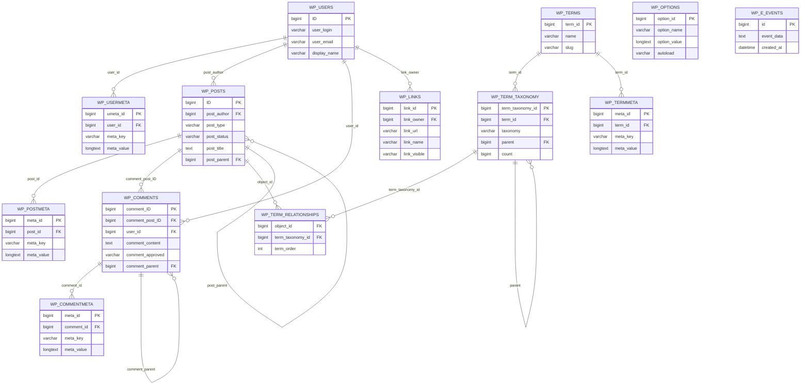

# DER real de la base de datos Seramor

## Objetivo

Este documento presenta el diagrama entidad-relacion de la base de datos real utilizada por el proyecto Seramor. El diagrama se construye a partir del volcado SQL incluido en [../backups/seramor.sql](../backups/seramor.sql) y mantiene los nombres reales de tablas y campos.

## Criterio de representacion

- Se representan las tablas efectivamente presentes en la base de datos.
- Se conservan los nombres reales de WordPress y de la tabla adicional `wp_e_events`.
- Las relaciones se trazan segun la estructura y el funcionamiento real del esquema, aunque WordPress no declare la mayoria de ellas mediante claves foraneas explicitas en MySQL.
- Se incluyen tambien las relaciones jerarquicas internas presentes en campos como `post_parent`, `comment_parent` y `parent`.

## Tablas incluidas

- `wp_users`
- `wp_usermeta`
- `wp_posts`
- `wp_postmeta`
- `wp_comments`
- `wp_commentmeta`
- `wp_terms`
- `wp_term_taxonomy`
- `wp_term_relationships`
- `wp_termmeta`
- `wp_links`
- `wp_options`
- `wp_e_events`

## DER en Mermaid

## Lectura general del modelo

- `wp_users` almacena los usuarios del sistema.
- `wp_usermeta` extiende la informacion de usuario mediante pares clave-valor.
- `wp_posts` concentra publicaciones, paginas, adjuntos y otros tipos de contenido propios de WordPress.
- `wp_postmeta` amplía la informacion de cada registro de `wp_posts`.
- `wp_comments` almacena comentarios asociados a publicaciones y puede formar jerarquias mediante `comment_parent`.
- `wp_commentmeta` contiene metadatos asociados a comentarios.
- `wp_terms`, `wp_term_taxonomy` y `wp_term_relationships` implementan la clasificacion de contenidos.
- `wp_termmeta` agrega metadatos a los terminos.
- `wp_links` y `wp_options` forman parte del esquema real aunque no ocupan un papel central en el funcionamiento actual del sitio.
- `wp_e_events` aparece como tabla adicional del sistema y no presenta una relacion estructural directa con el resto de tablas en el dump analizado.

## Observaciones sobre el esquema real

- La base usa el prefijo `wp_` propio de WordPress.
- El motor de almacenamiento es InnoDB, pero el esquema no define la mayor parte de sus relaciones mediante restricciones `FOREIGN KEY`.
- La ausencia de claves foraneas explicitas no impide identificar un DER real, porque las relaciones siguen existiendo a nivel estructural y funcional.
- Las tablas de metadatos (`wp_usermeta`, `wp_postmeta`, `wp_commentmeta`, `wp_termmeta`) responden al modelo flexible caracteristico de WordPress.

## Conclusion

El diagrama anterior representa la base de datos real del proyecto Seramor con los nombres efectivos de sus tablas y las relaciones que se desprenden de su estructura y uso. Por ello, puede utilizarse como referencia valida del esquema de datos implementado en el sistema.