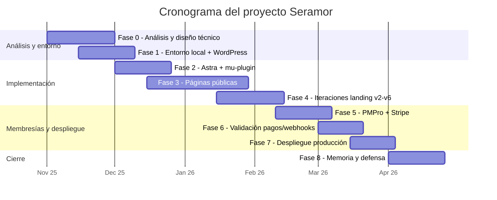
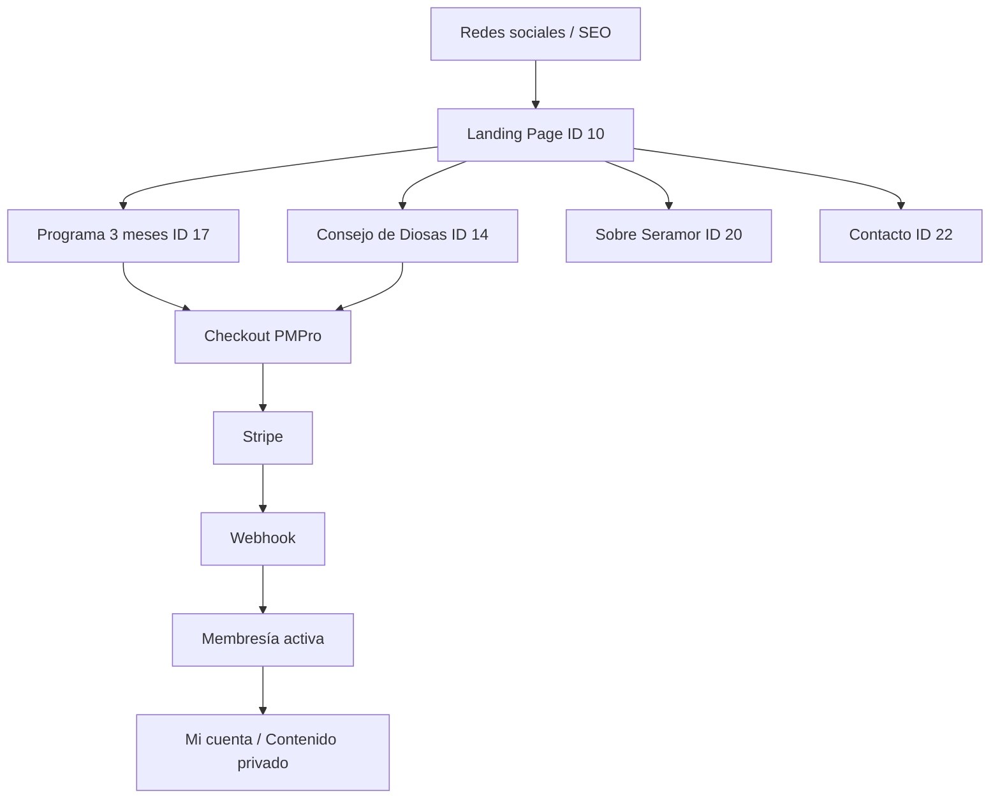
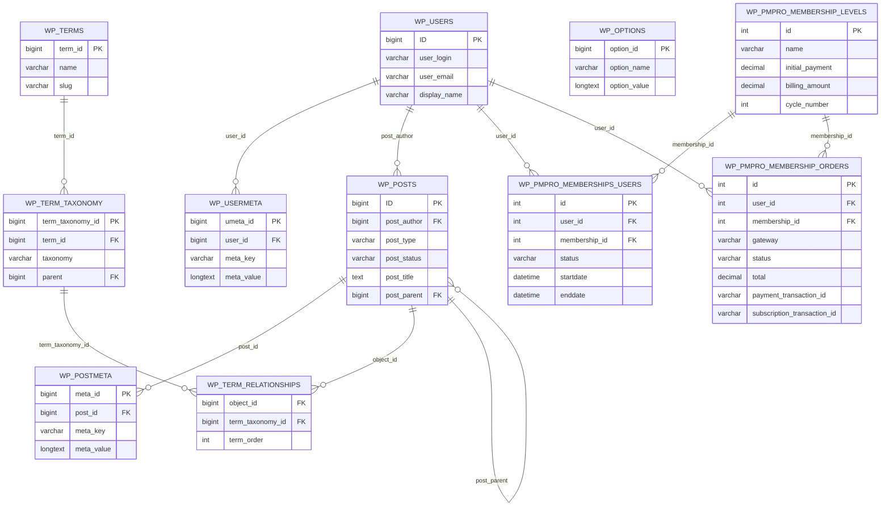
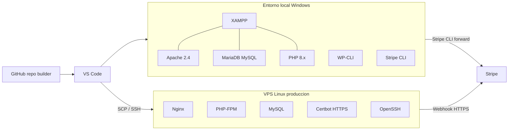
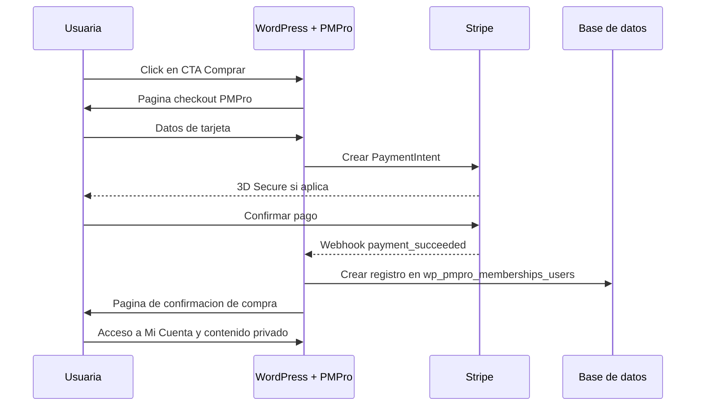

# Diseño y desarrollo del sitio web de Seramor mediante WordPress, Gutenberg y automatización con WP-CLI

**Proyecto / marca:** Seramor
**Centro:** CESUR
**Ciclo formativo:** Desarrollo de Aplicaciones Web
**Módulo:** Proyecto Intermodular
**Curso escolar:** 2do curso
**Autor/a:** Candela Otero Gallego

---

> **Nota de formato para la versión final en Word/PDF:**
> A4, márgenes 2,5 cm izq · 1,5 cm der · 3 cm sup · 2 cm inf, interlineado 1,5,
> texto en Arial 11 justificado, títulos en Arial 12 negrita, encabezado con
> "Proyecto fin de grado" a la izquierda y nombre del autor a la derecha,
> pie de página con número de página centrado. Extensión objetivo 20-25
> páginas (máx. 30 sin contar anexos ni bibliografía).

---

## Índice

1. Introducción
2. Objetivos
3. Marco teórico
4. Desarrollo del proyecto
5. Resultados
6. Conclusiones
7. Bibliografía
8. Anexos

---

## 1. Introducción

### 1.1 Presentación del proyecto

El presente proyecto consiste en el diseño, desarrollo y despliegue del sitio
web de **Seramor**, una marca personal vinculada al desarrollo personal,
la espiritualidad práctica y el acompañamiento femenino. Seramor se define
como un círculo de mujeres online orientado a ayudar a mujeres que desean
sanar aspectos emocionales, superar bloqueos internos, crecer personalmente
y construir una vida más libre y alineada con sus valores.

La persona visible y fundadora del proyecto es Elena Sofía, que actúa como
facilitadora principal de los círculos de mujeres y como representante
pública de la marca. A partir de esta base, el proyecto web traslada la
identidad de Seramor, su propuesta de valor y su oferta principal a un
entorno digital propio, estructurado, automatizado y portable entre los
entornos local y de producción.

A diferencia de un trabajo puramente teórico, este proyecto entrega un
sistema **real, desplegado y operativo** sobre un servidor de producción,
con membresías, pasarela de pago activa, contenido gestionable y un flujo
de despliegue reproducible.

### 1.2 Justificación del proyecto

La elección del proyecto responde a una necesidad real de negocio.
Actualmente, Seramor cuenta con visibilidad en redes sociales y comunidad
digital consolidada, pero carece de un sitio web que cumpla tres funciones
clave:

1. **Comunicar con claridad** la propuesta de valor y los productos de la
   marca.
2. **Convertir** las visitas procedentes de redes sociales en compras o
   suscripciones de forma directa.
3. **Automatizar** la gestión de membresías y cobros recurrentes, hoy
   sostenida por procesos manuales (WhatsApp, llamadas, masterclass,
   comprobantes).

El sistema actual depende fuertemente del esfuerzo humano. La web propuesta
reduce esa fricción, refuerza la imagen profesional de la marca y
permite a la fundadora dedicar su tiempo al acompañamiento real, no a
tareas administrativas.

### 1.3 Contexto del proyecto Seramor

Seramor está orientado principalmente a mujeres que perciben una situación
de estancamiento personal, emocional o profesional y que buscan sanar,
crecer y transformar su vida. La oferta se articula en dos productos:

- **Programa de 3 meses** (pago único de 500 € o 3 cuotas de 180 €). Es el
  producto principal y se estructura en tres fases progresivas:
  niña interior y heridas emocionales, relaciones y bloqueos presentes,
  expansión personal y proyección hacia una nueva vida.
- **Consejo de Diosas** (suscripción mensual de 39 €). Espacio privado de
  contenido continuo, accesible mediante membresía.

### 1.4 Alcance del trabajo

El alcance comprende el ciclo completo del producto:

- Análisis del modelo de negocio y captura de requisitos.
- Diseño de arquitectura de información y modelo de datos.
- Definición de la infraestructura local y de producción.
- Implementación del sitio sobre WordPress 6.9.4 + tema Astra 4.12.6,
  utilizando bloques nativos de **Gutenberg** y un *mu-plugin* propio.
- Construcción asistida y reproducible de las páginas mediante scripts
  PHP ejecutados con **WP-CLI**.
- Integración de **Paid Memberships Pro** y **Stripe** para gestión de
  membresías y cobros.
- Despliegue del sistema en un VPS Linux con Nginx, PHP-FPM, MySQL y
  HTTPS.
- Validación funcional, responsive y de pasarela de pago end-to-end.

Quedan fuera del alcance: campañas de email marketing operativas,
analítica avanzada, optimización SEO profesional y producción de contenidos
multimedia adicionales (vídeos, podcasts).

---

## 2. Objetivos

### 2.1 Objetivo general

Diseñar, implementar y desplegar el sitio web de Seramor sobre WordPress,
con un enfoque centrado en captación, conversión y gestión automatizada de
membresías, sustituyendo procesos manuales por un sistema técnico
reproducible, portable y mantenible.

### 2.2 Objetivos específicos

- Analizar la situación actual de la marca y traducirla en requisitos
  funcionales y no funcionales.
- Definir una arquitectura de información clara, orientada a conversión
  hacia el programa de 3 meses.
- Modelar la base de datos del sistema partiendo del esquema real de
  WordPress y Paid Memberships Pro.
- Construir las páginas mediante **bloques Gutenberg generados por
  scripts PHP**, garantizando trazabilidad en código y reproducibilidad.
- Implementar un **mu-plugin propio** que resuelva la portabilidad de
  imágenes y enlaces entre entornos.
- Integrar **PMPro + Stripe** para vender el programa y gestionar la
  suscripción mensual.
- Configurar la infraestructura de desarrollo local con XAMPP y la de
  producción sobre un VPS Linux con Nginx y HTTPS.
- Definir un **procedimiento de despliegue** reproducible mediante SCP y
  SSH.
- Validar el sistema con pruebas de pago en modo *test* de Stripe.

---

## 3. Marco teórico

### 3.1 La web como activo estratégico de marca

Una web profesional no cumple solo una función informativa: actúa como
activo estratégico de comunicación, captación y conversión. En proyectos
de marca personal vinculados al acompañamiento, la web debe combinar
claridad informativa, conexión emocional y arquitectura funcional. Una
buena web reduce la dependencia de canales externos para explicar
servicios o cerrar ventas, y centraliza la propuesta de valor.

### 3.2 Arquitectura de la información

La arquitectura de la información organiza el contenido de un sitio de
forma lógica y comprensible para la persona usuaria. Una arquitectura
clara reduce confusión, mejora la orientación dentro del sitio y favorece
la conversión. En Seramor, donde la web debe guiar a la usuaria hacia un
producto concreto, la jerarquía de páginas y la disposición de las
llamadas a la acción son determinantes.

### 3.3 Experiencia de usuario y diseño orientado a conversión

La experiencia de usuario es el conjunto de percepciones que obtiene una
persona al interactuar con un entorno digital. En sitios orientados a
conversión, cada bloque y cada llamada a la acción debe tener una
intención clara y medible. En Seramor, el recorrido busca acompañar a la
usuaria desde el interés inicial hasta la decisión de compra, sin pasos
intermedios manuales.

### 3.4 WordPress como gestor de contenidos

WordPress es uno de los CMS más utilizados a nivel global. Se eligió como
base por cuatro motivos:

- Permite a la cliente final mantener contenido sin conocimientos técnicos.
- Cuenta con un ecosistema de plugins maduros para membresía, pagos,
  formularios y SEO.
- Es portable: cualquier hosting con LAMP/LEMP puede alojarlo.
- Su API y WP-CLI permiten automatizar la construcción del sitio mediante
  código.

### 3.5 Gutenberg y construcción programática de páginas

Gutenberg es el editor de bloques nativo de WordPress desde 2018. Cada
página es un árbol de bloques serializados como HTML con comentarios
delimitadores (`<!-- wp:block ... -->`). Esta característica permite
**generar el contenido de las páginas mediante código PHP**, en lugar de
maquetar manualmente con un constructor visual.

En este proyecto se ha optado por construir el sitio mediante **scripts
PHP versionados en Git**, ejecutados con WP-CLI. Esta decisión, frente a
la alternativa habitual (constructores visuales tipo Elementor), se
justifica por:

- **Trazabilidad:** cada página queda representada como código fuente
  en el repositorio, no como datos opacos en base de datos.
- **Reproducibilidad:** el sitio puede reconstruirse íntegramente con un
  comando.
- **Portabilidad:** no se depende de licencias de terceros ni de plugins
  pesados.
- **Rendimiento:** Gutenberg nativo carga menos CSS/JS que los
  constructores comerciales.

### 3.6 Tema Astra y personalización por *mu-plugin*

Astra es un tema base ligero, ampliamente compatible con Gutenberg y con
PMPro. Se utiliza como capa de presentación, configurada de forma
programática (paleta, tipografías, layout).

Para resolver necesidades específicas que no cubre el tema, se ha
desarrollado un **mu-plugin** propio (`seramor-site-runtime.php`).

Un *mu-plugin* (de *must-use plugin*) es un tipo especial de plugin de
WordPress que se aloja en `wp-content/mu-plugins/` y se ejecuta
automáticamente en cada petición, **sin posibilidad de desactivarse desde
el panel de administración**. Se eligió este formato, en lugar de un
plugin normal, porque las funciones que implementa son críticas para la
integridad del sitio: si se desactivaran por error, las imágenes y los
enlaces internos dejarían de resolverse correctamente al cambiar de
entorno. Como mu-plugin queda garantizado que siempre está activo
mientras el archivo esté presente.

El mu-plugin se carga automáticamente y aplica:

- Inyección de tipografías personalizadas (Cormorant Garamond, Great Vibes).
- Overrides puntuales de CSS global de Astra.
- **Reescritura en *runtime* de URLs de imágenes** a partir de la clase
  `wp-image-{ID}`, garantizando que las páginas funcionen tanto en
  `localhost/seramor/` como en `https://candela-tfg.purenet.work/`.
- **Reescritura de enlaces internos** mediante el placeholder `__HOME__`,
  que se sustituye en cada petición por la URL base del entorno.

### 3.7 Membresías y pagos: PMPro + Stripe

**Paid Memberships Pro (PMPro)** es un plugin maduro de WordPress que
implementa niveles de membresía, control de acceso a contenido,
checkout, área de cuenta de usuario y conexión con pasarelas de pago.

**Stripe** es la pasarela de pago seleccionada por su robustez, soporte
para suscripciones recurrentes y por disponer de un modo *test* que
permite simular cobros antes de pasar a producción. La comunicación entre
Stripe y WordPress se realiza mediante un **webhook** que escucha los
eventos de pago (`invoice.payment_succeeded`, `checkout.session.completed`,
etc.) y actualiza la membresía del usuario en consecuencia.

### 3.8 Infraestructura LAMP/LEMP y despliegue

El proyecto se apoya en dos entornos paralelos:

- **Entorno de desarrollo (local):** stack LAMP empaquetado en XAMPP
  (Apache + MariaDB/MySQL + PHP).
- **Entorno de producción (remoto):** stack LEMP sobre VPS Linux (Nginx +
  PHP-FPM + MySQL), expuesto por HTTPS con certificado válido.

El despliegue se realiza por SCP y SSH, empaquetando la aplicación, el
volcado de base de datos y la carpeta `uploads`, evitando depender de
herramientas adicionales de CI/CD para mantener la solución autónoma y
auditable.

### 3.9 Diseño responsive y accesibilidad

Una parte significativa del tráfico potencial procede de redes sociales,
mayoritariamente desde dispositivos móviles. El diseño se valida en
escritorio, tablet y móvil, garantizando legibilidad, jerarquía visual y
accesibilidad básica de los elementos interactivos (tamaño de botones,
contraste, navegación con teclado).

---

## 4. Desarrollo del proyecto

### 4.1 Metodología y planificación

#### 4.1.1 Metodología de trabajo

Se ha empleado una metodología **incremental y orientada a producto**,
priorizando que cada fase entregara valor verificable. La secuencia
seguida fue:

1. Comprensión del modelo de negocio antes que del diseño visual.
2. Diseño técnico (arquitectura, infraestructura, modelo de datos)
   antes que la implementación.
3. Implementación incremental por páginas, validando cada una contra el
   guion visual de Canva y los textos definidos en Notion.
4. Integración de membresías y pagos como capa final, sobre una base ya
   validada.
5. Despliegue a producción reproduciendo el procedimiento documentado.

#### 4.1.2 Fases del proyecto

| Fase | Descripción | Entregable |
|------|-------------|------------|
| 0 | Análisis del negocio, requisitos y diseño técnico | Plan maestro y DER |
| 1 | Configuración de entorno local y base de WordPress | Sitio local navegable |
| 2 | Configuración de tema Astra y *mu-plugin* propio | Identidad visual aplicada |
| 3 | Construcción de la *landing page* y páginas públicas | Páginas v1 publicadas |
| 4 | Iteraciones de diseño y portabilidad (versiones v2 a v6) | Landing v6 final |
| 5 | Integración PMPro + Stripe (modo *test*) | Checkout funcional |
| 6 | Validación con pagos reales y webhooks | Membresías activadas automáticamente |
| 7 | Despliegue a producción y verificación | Sitio público en HTTPS |
| 8 | Documentación final y memoria | Memoria + presentación |

#### 4.1.3 Cronograma

El proyecto se desarrolló entre **noviembre de 2025 y abril de 2026**,
distribuyendo las fases descritas en la sección anterior a lo largo de
seis meses de trabajo.

| Mes | Fases | Hitos principales |
|-----|-------|-------------------|
| Noviembre 2025 | Fase 0 · Fase 1 | Análisis del negocio, requisitos, DER, plan maestro y entorno local XAMPP + WordPress operativo |
| Diciembre 2025 | Fase 2 · Fase 3 | Configuración programática de Astra, *mu-plugin* `seramor-site-runtime.php` y primera versión de la *landing page* |
| Enero 2026 | Fase 3 · Fase 4 | Construcción de las páginas Programa, Consejo y Contacto; iteraciones v2–v5 de la landing |
| Febrero 2026 | Fase 4 · Fase 5 | Cierre de la landing v6 e integración de Paid Memberships Pro + Stripe en modo *test* |
| Marzo 2026 | Fase 6 · Fase 7 | Validación de pagos y webhooks end-to-end; despliegue al VPS de producción con HTTPS |
| Abril 2026 | Fase 8 | Pruebas finales, redacción de la memoria y preparación de la defensa |



### 4.2 Análisis de requisitos

#### 4.2.1 Necesidades del proyecto

Seramor necesita un sistema que:

- Comunique con claridad la propuesta de valor.
- Permita la **compra directa** del programa de 3 meses sin intervención
  manual.
- Permita la **suscripción mensual** al Consejo de Diosas con renovación
  automática.
- Restrinja el acceso a contenido privado a personas con membresía
  activa.
- Sea mantenible por la propia fundadora (edición de textos, imágenes,
  precios) sin acceso a código.
- Sea portable entre el entorno local de desarrollo y el de producción.

#### 4.2.2 Público objetivo

Mujeres que se encuentran en una situación de estancamiento personal,
emocional o profesional, interesadas en el desarrollo personal, la
espiritualidad práctica o el emprendimiento. Capacidad económica
suficiente para invertir en un programa de 500 € (o tres cuotas de
180 €) o una suscripción mensual de 39 €.

#### 4.2.3 Requisitos funcionales

| Código | Requisito |
|--------|-----------|
| RF-01 | Página principal (landing) con propuesta de valor y CTA al programa |
| RF-02 | Página comercial del Programa de 3 meses con detalle y CTA a checkout |
| RF-03 | Página comercial del Consejo de Diosas con CTA a suscripción |
| RF-04 | Página "Sobre Seramor" con la historia de la fundadora |
| RF-05 | Página de contacto con formulario funcional |
| RF-06 | Páginas legales (privacidad, cookies) |
| RF-07 | Sistema de membresías con tres niveles: Programa pago único, Programa en plazos, Consejo mensual |
| RF-08 | Checkout integrado con Stripe en modo *test*, preparado para pasar a *live* |
| RF-09 | Activación automática de membresía tras pago confirmado por webhook |
| RF-10 | Área de cuenta de usuario (mi cuenta, facturación, cancelar suscripción) |
| RF-11 | Restricción de acceso a contenido privado por nivel de membresía |
| RF-12 | Visualización responsive correcta en escritorio, tablet y móvil |
| RF-13 | Menús de navegación coherentes y CTA visibles en todas las páginas |

#### 4.2.4 Requisitos no funcionales

| Código | Requisito |
|--------|-----------|
| RNF-01 | Coherencia con la identidad visual de marca (Canva) |
| RNF-02 | Tiempo de carga razonable (< 3 s en escritorio sobre fibra) |
| RNF-03 | Sitio servido por HTTPS en producción |
| RNF-04 | Portabilidad total entre entornos (URLs, imágenes y enlaces) |
| RNF-05 | Reproducibilidad: el sitio puede reconstruirse desde código y dump SQL |
| RNF-06 | Mantenibilidad: la fundadora puede editar contenido sin tocar código |
| RNF-07 | Trazabilidad: toda decisión técnica versionada en Git |
| RNF-08 | Aislamiento de credenciales en archivos `.env` fuera del repositorio |

### 4.3 Diseño de la solución

#### 4.3.1 Arquitectura de información

El sitio se organiza en torno a un embudo de conversión claro, donde la
landing centraliza el tráfico y deriva hacia los dos productos:



#### 4.3.2 Inventario de páginas

| ID | Página | Slug | Tipo |
|----|--------|------|------|
| 10 | Landing Page (HOME) | `landing-page` | Pública |
| 17 | Programa de 3 meses | `programa-de-3-meses` | Pública comercial |
| 14 | Consejo de Diosas | `plataforma-de-contenido-por-suscripcion` | Pública comercial + zona privada |
| 20 | Sobre Seramor | `sobre-seramor` | Pública |
| 12 | Servicios | `catalogo-de-servicios` | Pública |
| 22 | Contacta con nosotras | `contacta-con-nosotras` | Pública |
| 3 | Política de privacidad | `politica-privacidad` | Legal |
| — | Páginas operativas PMPro | `account`, `checkout`, `login`, `levels`, etc. | Sistema |

#### 4.3.3 Identidad visual

| Elemento | Valor |
|----------|-------|
| Color primario | Verde bosque oscuro `#37432b` |
| Color secundario | Marrón vino `#733015` |
| Color acento | Dorado cálido `#fce8a4` |
| Color fondo | Crema `#faf7f0` |
| Tipografía cuerpo | Cormorant Garamond |
| Tipografía display | Great Vibes (logotipos y heros) |

La paleta se define en código y se aplica de forma programática mediante
`scripts/configure-astra.php`, lo que garantiza coherencia y permite
versionar cualquier cambio.

#### 4.3.4 Modelo de datos

El sistema reutiliza el esquema canónico de WordPress (prefijo `wp_`) y lo
extiende con las tablas de Paid Memberships Pro. El motor de
almacenamiento es InnoDB. Aunque WordPress no declara la mayoría de
relaciones mediante claves foráneas, las relaciones funcionales sí
existen y se reflejan en el siguiente diagrama:



> El DER detallado, incluyendo las relaciones internas jerárquicas y las
> tablas auxiliares, está disponible en el anexo técnico.

### 4.4 Infraestructura

#### 4.4.1 Visión general

El sistema se compone de dos entornos paralelos con configuraciones
equivalentes pero stacks distintos:



#### 4.4.2 Entorno local de desarrollo

| Componente | Versión / detalle |
|------------|-------------------|
| Sistema operativo | Windows 11 |
| Stack | XAMPP (LAMP empaquetado) |
| Servidor web | Apache 2.4 |
| Base de datos | MariaDB / MySQL (BD `seramor`, usuario `root`) |
| Lenguaje | PHP 8.x |
| Automatización | WP-CLI (`wp-cli.phar`) |
| Webhooks Stripe | Stripe CLI (`stripe listen --forward-to`) |
| Editor | Visual Studio Code |
| Túnel HTTPS puntual | Dev Tunnels (exposición temporal de `localhost` para webhooks externos) |
| Versionado | Git + GitHub |

#### 4.4.3 Entorno remoto de producción

| Componente | Detalle |
|------------|---------|
| Proveedor | VPS Linux (`51.222.86.254`) |
| Dominio | `https://candela-tfg.purenet.work/` |
| Servidor web | Nginx |
| Ejecutor PHP | PHP-FPM |
| Base de datos | MySQL (BD `cande_wp`, usuario `cande_user`) |
| Acceso | OpenSSH puerto 22, autenticación con clave Ed25519 |
| Cifrado | Certificado TLS válido, HTTPS forzado |
| Path raíz | `/var/www/cande/public_html` |
| Webhook Stripe | `https://candela-tfg.purenet.work/wp-admin/admin-ajax.php?action=stripe_webhook` |

#### 4.4.4 Stack de aplicación común

| Componente | Versión |
|------------|---------|
| WordPress | 6.9.4 |
| Tema | Astra 4.12.6 |
| Editor | Gutenberg (nativo) |
| Membresía | Paid Memberships Pro (última estable) |
| Pasarela | Stripe (claves *test*) |
| *Mu-plugin* propio | `seramor-site-runtime.php` (tipografías, portabilidad y chrome del sitio) |

#### 4.4.5 Servicios externos

- **Stripe** (pagos, suscripciones, webhooks).
- **GitHub** (repositorio del *builder*).
- **Pinterest, Canva, Notion** (referencias visuales y contenido).

### 4.5 Implementación

#### 4.5.1 Organización en dos repositorios

El proyecto está dividido en **dos repositorios independientes**, alojados
en GitHub bajo la cuenta `candelaagallegoo`:

| Repositorio | URL | Ruta local | Función |
|-------------|-----|------------|---------|
| **Builder** | https://github.com/candelaagallegoo/seramor_builder | `C:\Users\cande\Desktop\PROGRAMACION\WEBSITE_BUILDER_WORKSPACE` | Scripts de construcción, planes, documentación (incluye este TFG) |
| **Website** | https://github.com/candelaagallegoo/serarmor_website | `C:\xampp\htdocs\seramor` | Instalación WordPress completa que se despliega al servidor |

Esta separación responde a un principio de **separación de
responsabilidades**: el código que *genera* el sitio no se mezcla con la
aplicación *generada*. El builder es la herramienta de trabajo; el
website es el producto desplegable.

#### 4.5.2 Estrategia de construcción del sitio

El sitio **no se construye haciendo clic en el panel de WordPress**, sino
ejecutando scripts versionados. Cada página principal corresponde a un
script PHP en la carpeta `scripts/`:

| Script | Página construida |
|--------|-------------------|
| `build-landing-v6.php` | Landing (ID 10), versión actual |
| `build-programa.php` | Programa de 3 meses (ID 17) |
| `build-consejo.php` | Consejo de Diosas pública (ID 14) |
| `build-consejo-privado.php` | Zona privada del Consejo |
| `build-contact.php` | Contacto (ID 22) |
| `configure-astra.php` | Tema Astra: paleta, tipografías, layout |
| `configure-pmpro.php` | PMPro: niveles, páginas operativas, divisa |
| `configure-menu.php` | Menús de navegación |
| `upload-images.ps1` | Subida masiva de imágenes a Media Library |
| `start-stripe-listener.ps1` | Arranque del listener de Stripe CLI |

Los scripts se ejecutan así:

```powershell
c:\xampp\php\php.exe c:\xampp\htdocs\seramor\wp-cli.phar `
  eval-file scripts/build-landing-v6.php `
  --path="c:\xampp\htdocs\seramor"
```

#### 4.5.3 Mu-plugin propio: portabilidad de contenido

El mu-plugin `seramor-site-runtime.php` resuelve el problema clásico de WordPress:
las URLs absolutas guardadas en el contenido. Implementa dos
transformaciones en *runtime*:

- **Imágenes:** detecta `` y reescribe el
  atributo `src` consultando `wp_get_attachment_url($ID)`. Así, el HTML
  guardado en BD no contiene URLs absolutas: la imagen se resuelve en cada
  petición según el entorno.
- **Enlaces internos:** sustituye el placeholder `__HOME__` por la URL
  base del sitio (`get_home_url()`) en cada renderizado.

Esto permite que **el mismo dump SQL funcione idénticamente en local
(`http://localhost/seramor/`) y en producción (`https://candela-tfg.purenet.work/`)**,
sin scripts de búsqueda y reemplazo masivo.

#### 4.5.4 Integración Paid Memberships Pro + Stripe

Se han configurado tres niveles de membresía:

| Nivel | Precio | Tipo |
|-------|--------|------|
| Programa 3 meses — Pago único | 500 € | Pago único |
| Programa 3 meses — Plazos | 3 × 180 € | Pago recurrente limitado |
| Consejo de Diosas | 39 € / mes | Suscripción recurrente |

PMPro genera automáticamente las páginas operativas del sistema (login,
registro, checkout, cuenta, confirmación, niveles, facturación) y delega
el cobro en Stripe.

#### 4.5.5 Flujo de pago end-to-end



#### 4.5.6 Procedimiento de despliegue

El despliegue se ejecuta desde la máquina local con un guion fijo y
documentado:

1. Generar dump SQL local con `mysqldump --single-transaction`.
2. Empaquetar `wp-content/uploads` con `tar`.
3. Empaquetar la aplicación excluyendo `.git`, `.env*`, `wp-config.php`,
   `uploads` y `backups`.
4. Subir los tres paquetes al servidor por SCP.
5. Descomprimir la aplicación en `/var/www/cande/public_html`.
6. Subir `.env.server` con las credenciales remotas y activar el
   `wp-config-sample.php` que las lee.
7. Importar el dump SQL en MySQL remoto.
8. Restaurar la carpeta `uploads`.
9. Recrear el webhook de Stripe apuntando al dominio remoto.
10. Verificar accesibilidad por HTTPS.

Este procedimiento, descrito en detalle en
`docs/stripe-local-y-server.md` y `docs/integraciones.md`, es
**reproducible en cualquier momento** y elimina la dependencia de
clientes FTP visuales o de paneles de hosting.

### 4.6 Pruebas y validación

#### 4.6.1 Pruebas funcionales

- Navegación entre todas las páginas y verificación de CTAs.
- Activación y validación de los menús de navegación.
- Comprobación de formularios (envío y recepción).
- Verificación de la restricción de acceso a contenido privado por nivel
  de membresía.

#### 4.6.2 Validación responsive

Verificación visual y funcional en tres anchos de referencia:
escritorio (1440 px), tablet (768 px) y móvil (390 px), en navegadores
Chromium y Firefox. Validación de que el menú hamburguesa, las imágenes
y los CTAs se adaptan correctamente.

#### 4.6.3 Pruebas de pago end-to-end

- **Modo test:** se realizaron compras con tarjetas de prueba de Stripe
  (`4242 4242 4242 4242`), incluyendo el escenario de pago en plazos y
  el de suscripción mensual.
- **Verificación de webhooks:** se utilizó **Stripe CLI** para reenviar
  los eventos al WordPress local. Se comprobó que tras el evento
  `invoice.payment_succeeded`, la fila correspondiente aparece en
  `wp_pmpro_memberships_users` con `status = active`.
#### 4.6.4 Validación frente a los objetivos

Cada objetivo específico definido en la sección 2.2 ha sido verificado
mediante una evidencia concreta: capturas, registros en base de datos o
ejecución reproducible de scripts. El detalle aparece en el anexo
técnico.

### 4.7 Problemas encontrados y soluciones aplicadas

A lo largo del desarrollo aparecieron tres problemas significativos que
condicionaron decisiones técnicas relevantes:

**1. Webhooks de Stripe no alcanzaban el entorno local.**
Los pedidos quedaban en estado `token` y la membresía nunca se activaba.
Stripe no puede llegar a `localhost`. Se resolvió con dos vías
complementarias: **Stripe CLI** (`stripe listen --forward-to ...`) para
desarrollo cotidiano, y un **túnel público** (Dev Tunnels) cuando se
requería que el endpoint fuera accesible desde Internet (por ejemplo,
para reconfigurar el webhook desde el panel de Stripe).

**2. Portabilidad de URLs entre local y remoto.**
WordPress guarda URLs absolutas dentro del contenido HTML. Esto rompe el
sitio al moverlo de entorno. En lugar del clásico *search & replace*
sobre el dump SQL, se desarrolló una capa de reescritura en el mu-plugin
basada en `class="wp-image-{ID}"` para imágenes y un placeholder
`__HOME__` para enlaces. Resultado: **el mismo dump SQL funciona en
ambos entornos sin transformación**.

**3. Decisión de abandonar Elementor en favor de Gutenberg + scripts.**
Inicialmente se planteó el uso del constructor visual Elementor, pero su
contenido se almacena como datos opacos en `postmeta`, dificultando el
versionado en Git, la reproducibilidad y la portabilidad. Tras evaluar
el coste/beneficio, se optó por construir el sitio mediante **bloques
Gutenberg generados por código**. Esta decisión añadió complejidad
inicial pero entregó beneficios estructurales: trazabilidad total,
sitio reconstruible con un comando, ausencia de dependencias de pago y
mejor rendimiento.

---

## 5. Resultados

### 5.1 Resultado general

Se ha entregado un sistema **operativo y desplegado en producción**,
accesible públicamente en `https://candela-tfg.purenet.work/`, con
checkout funcional, membresías activas y procedimiento de despliegue
reproducible. El sitio ya no depende de procesos manuales para vender ni
para activar accesos.

### 5.2 Resultados por apartado

| Apartado | Resultado |
|----------|-----------|
| Arquitectura de información | 7 páginas públicas + páginas operativas PMPro, embudo claro hacia el programa principal |
| Identidad visual | Paleta y tipografías aplicadas de forma programática y coherente |
| Construcción del sitio | 11 scripts PHP versionados que reconstruyen el sitio íntegramente |
| Portabilidad | Mismo dump SQL funcional en local y producción sin transformación |
| Membresías | 3 niveles configurados, control de acceso operativo |
| Pagos | Compras en modo *test* validadas, webhooks respondiendo correctamente |
| Infraestructura | LAMP local + LEMP remoto con HTTPS funcional |
| Despliegue | Procedimiento documentado y ejecutable en menos de 15 minutos |

### 5.3 Evidencias visuales

`[COMPLETAR: insertar capturas finales en la versión PDF]`

Listado de figuras previstas:

- **Figura 1.** Vista general de la *landing page* en escritorio.
- **Figura 2.** Página del Programa de 3 meses con CTA de checkout.
- **Figura 3.** Página del Consejo de Diosas con bloque de suscripción.
- **Figura 4.** Vista responsive en móvil de la landing.
- **Figura 5.** Panel PMPro con los niveles configurados.
- **Figura 6.** Stripe Dashboard mostrando un evento de pago confirmado.
- **Figura 7.** Tabla `wp_pmpro_memberships_users` con membresía activa
  tras un pago de prueba.
- **Figura 8.** Salida de `stripe listen` reenviando eventos a localhost.
- **Figura 9.** Sitio público en `https://candela-tfg.purenet.work/` con
  candado HTTPS válido.

---

## 6. Conclusiones

El proyecto ha permitido entregar un sistema web **real, completo y
operativo** que sustituye un flujo de venta manual por una plataforma
automatizada, manteniendo en todo momento el control técnico sobre el
producto: cada decisión queda versionada, cada cambio se reproduce y
ningún componente depende de un servicio cerrado o de difícil migración.

Tres aprendizajes destacan por encima del resto:

- **La planificación técnica vale más que el constructor visual.**
  Diseñar primero la arquitectura, el modelo de datos y la estrategia
  de portabilidad evitó muchas horas de retrabajo posterior.
- **La automatización paga su coste rápidamente.** Construir el sitio
  con scripts WP-CLI fue inicialmente más lento que arrastrar bloques
  con el ratón, pero permitió iterar la *landing page* hasta seis
  versiones sin perder consistencia, y reproducir todo el sitio en un
  entorno nuevo en minutos.
- **Los detalles de infraestructura son parte del producto.** El
  webhook de Stripe, el certificado TLS o el formato del dump SQL no
  son "tareas accesorias": son lo que diferencia un prototipo
  académico de un sistema en producción.

### 6.1 Mejoras futuras

- Integración con plataforma de email marketing (Brevo / Mailerlite) y
  automatización de secuencias post-compra.
- Optimización SEO técnica (sitemap, datos estructurados, Core Web
  Vitals).
- Analítica de conversión (eventos de checkout, funnels).
- Pop-ups contextuales para usuarias no logueadas que intentan acceder
  a contenido privado.
- Pipeline de despliegue automatizado mediante GitHub Actions.
- Backups programados y monitorización del servidor.
- Política completa de cookies con banner conforme al RGPD.

---

## 7. Bibliografía

- WordPress.org — *Documentación oficial de WordPress*.
  https://wordpress.org/documentation/
- WordPress Developer — *Block Editor Handbook (Gutenberg)*.
  https://developer.wordpress.org/block-editor/
- WP-CLI — *Documentación oficial*.
  https://wp-cli.org/
- Brainstorm Force — *Astra Theme Documentation*.
  https://wpastra.com/docs/
- Paid Memberships Pro — *Documentation*.
  https://www.paidmembershipspro.com/documentation/
- Stripe — *API Reference y Stripe CLI*.
  https://docs.stripe.com/
- Nginx — *Documentation*.
  https://nginx.org/en/docs/
- Apache HTTP Server — *Documentation*.
  https://httpd.apache.org/docs/
- MySQL — *Reference Manual*.
  https://dev.mysql.com/doc/
- Krug, S. (2014). *Don't Make Me Think, Revisited: A Common Sense
  Approach to Web Usability*. New Riders.
- Material interno de planificación del proyecto Seramor (Notion, Canva,
  Pinterest).

---

## 8. Anexos

### 8.1 Anexo técnico — Repositorios del proyecto

El proyecto se organiza en **dos repositorios separados**, cada uno con su
entorno local de trabajo y su remoto correspondiente en GitHub. Esta
separación permite versionar y desplegar el sitio sin mezclar el código
de construcción (*builder*) con la aplicación WordPress final.

#### Repositorio 1 — Builder (este documento vive aquí)

- **GitHub remoto:** https://github.com/candelaagallegoo/seramor_builder
- **Ruta local:** `C:\Users\cande\Desktop\PROGRAMACION\WEBSITE_BUILDER_WORKSPACE`
- **Contenido:** scripts PHP/PowerShell que construyen las páginas,
  configuran Astra y PMPro, suben imágenes y arrancan el listener de
  Stripe; documentación del proyecto (este TFG, plan maestro, DER,
  integraciones).
- **Función:** acta como entorno de trabajo y herramienta de generación.
  No se despliega al servidor.

Estructura del repositorio:

```
docs/
  plans/plan-maestro.md
  der-seramor-mermaid.md
  integraciones.md
  stripe-local-y-server.md
  link.md
  entrega_proyecto.md   (este documento)
scripts/
  build-landing-v6.php
  build-programa.php
  build-consejo.php
  build-consejo-privado.php
  build-contact.php
  configure-astra.php
  configure-astra-v2.php
  configure-pmpro.php
  configure-menu.php
  catalog-images.php
  inject-css.php
  upload-images.ps1
  extract-svg-images.ps1
  start-stripe-listener.ps1
  print-pmpro-stripe-webhook.php
backups/
  (dumps SQL y empaquetados de uploads)
```

#### Repositorio 2 — Website (instalación WordPress)

- **GitHub remoto:** https://github.com/candelaagallegoo/serarmor_website
- **Ruta local:** `C:\xampp\htdocs\seramor`
- **Contenido:** instalación completa de WordPress 6.9.4, tema Astra,
  plugins (PMPro, Stripe), el *mu-plugin* propio `seramor-site-runtime.php` y
  los uploads de la Media Library.
- **Función:** es la aplicación real que se ejecuta sobre XAMPP en local
  y se despliega al VPS de producción por SCP/SSH.

### 8.2 Anexo de código

Fragmentos representativos del código del proyecto. El código completo
está versionado en los repositorios indicados en el Anexo 8.1.

#### 8.2.1 Mu-plugin: reescritura de imágenes por clase `wp-image-{ID}`

Extracto de `wp-content/mu-plugins/seramor-site-runtime.php`. Garantiza que el
mismo HTML funcione en local y producción sin reemplazos masivos en BD.

```php
add_filter( 'the_content', function ( $content ) {
    if ( ! is_string( $content ) || $content === '' ) {
        return $content;
    }
    return preg_replace_callback(
        '/]*?)class="([^"]*\bwp-image-(\d+)\b[^"]*)"([^>]*)>/i',
        function ( $m ) {
            $attachment_id = (int) $m[3];
            $real_url = wp_get_attachment_url( $attachment_id );
            if ( ! $real_url ) {
                return $m[0];
            }
            $tag = $m[0];
            // Sustituye el atributo src por la URL real del entorno activo.
            $tag = preg_replace(
                '/\bsrc="[^"]*"/i',
                'src="' . esc_url( $real_url ) . '"',
                $tag
            );
            return $tag;
        },
        $content
    );
}, 20 );

// Sustituye el placeholder __HOME__ por la URL base del entorno.
add_filter( 'the_content', function ( $content ) {
    return str_replace( '__HOME__', untrailingslashit( home_url() ), $content );
}, 21 );
```

#### 8.2.2 Construcción de página con bloques Gutenberg desde PHP

Patrón común usado en los scripts `build-*.php`. El contenido queda
representado como comentarios Gutenberg (`<!-- wp:... -->`) que WordPress
interpreta como bloques nativos.

```php
$blocks  = '<!-- wp:cover {"url":"__HOME__/wp-content/uploads/hero.jpg"} -->';
$blocks .= '<div class="wp-block-cover">';
$blocks .= '  <!-- wp:heading {"level":1} -->';
$blocks .= '  <h1>Seramor — Círculo de mujeres</h1>';
$blocks .= '  <!-- /wp:heading -->';
$blocks .= '</div>';
$blocks .= '<!-- /wp:cover -->';

wp_update_post( [
    'ID'           => 10,              // Landing page
    'post_content' => $blocks,
    'post_status'  => 'publish',
] );
```

#### 8.2.3 Despliegue: empaquetado de aplicación y dump SQL

Fragmento del guion de despliegue (ver Anexo 8.4 para la secuencia
completa).

```powershell
# Volcado de la base de datos con transacción consistente.
& "C:\xampp\mysql\bin\mysqldump.exe" -u root --single-transaction `
  --default-character-set=utf8mb4 `
  --result-file=.\backups\seramor.sql seramor

# Empaquetado de uploads (imágenes y adjuntos).
tar -czf .\backups\seramor-uploads.tar.gz -C C:\xampp\htdocs\seramor wp-content\uploads

# Empaquetado de la aplicación excluyendo secretos y artefactos locales.
tar -czf .\backups\seramor-app.tar.gz `
    --exclude='.git' --exclude='.env*' --exclude='wp-config.php' `
    --exclude='wp-content/uploads' --exclude='backups' `
    -C C:\xampp\htdocs seramor
```


### 8.3 Anexo de planificación

- Plan maestro con fases, IDs de páginas y estado real:
  https://github.com/candelaagallegoo/seramor_builder/blob/main/docs/plans/plan-maestro.md
- DER detallado en Mermaid:
  https://github.com/candelaagallegoo/seramor_builder/blob/main/docs/der-seramor-mermaid.md
- Documento de integración Stripe local y server:
  https://github.com/candelaagallegoo/seramor_builder/blob/main/docs/stripe-local-y-server.md
- Documento de integraciones (claves y webhooks):
  https://github.com/candelaagallegoo/seramor_builder/blob/main/docs/integraciones.md

### 8.4 Anexo de comandos clave

**Generar dump local:**
```powershell
& "C:\xampp\mysql\bin\mysqldump.exe" -u root --single-transaction `
  --default-character-set=utf8mb4 `
  --result-file=.\backups\seramor.sql seramor
```

**Listener Stripe en local:**
```powershell
stripe listen --forward-to `
  "https://localhost/seramor/wp-admin/admin-ajax.php?action=stripe_webhook"
```

**Despliegue (resumen):**
```powershell
scp .\backups\seramor.sql .\backups\seramor-uploads.tar.gz `
    .\backups\seramor-app.tar.gz cande@51.222.86.254:/tmp/
ssh cande@51.222.86.254 "tar -xzf /tmp/seramor-app.tar.gz `
    -C /var/www/cande/public_html"
ssh cande@51.222.86.254 "cat /tmp/seramor.sql | `
    mysql -h localhost -u cande_user -p'***' cande_wp"
ssh cande@51.222.86.254 "tar -xzf /tmp/seramor-uploads.tar.gz `
    -C /var/www/cande/public_html"
```

### 8.5 Aviso sobre credenciales

Todas las credenciales del proyecto (base de datos, SSH, claves de
Stripe) se gestionan en archivos `.env.local` y `.env.server`
**fuera del repositorio Git**, conforme a buenas prácticas de seguridad
(OWASP A05: *Security Misconfiguration*). En este documento solo se
referencian de forma genérica.
